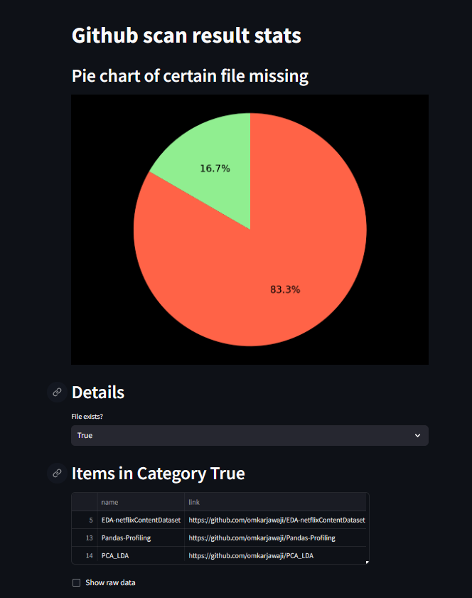
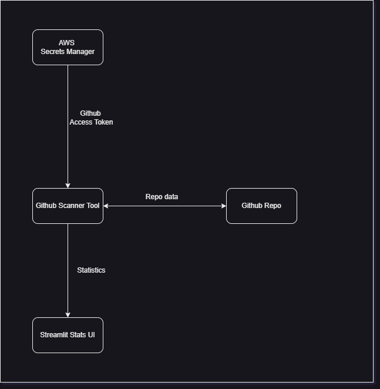

# Github-repo-scanner


## Table of Contents

- [Introduction](#introduction)
- [Installation](#installation)
- [UI](#UI)
- [Architecture](#architecture)
- [License](#license)


## Introduction

A tool that could be used to validate the availability or track the unavailablity of required files in a Git Repository. 
Helpful to validate and maintain the integrity of repositories. 

### Example:
If we need to have a Jenkins file in every repository of a department and further have required code quality 
scans also, we cna utilize this tool by adding more functionalities.

## Installation

Instructions for how to run the tool locally.

Open your Git CLI or any terminal that can understand bash commands.

```bash
# Clone the repository
gh repo clone omkarjawaji/Github-repo-scanner

# Navigate to the project directory
cd Github-repo-scanner

# Install the required dependencies
pip install -r requirements.txt

# Run the application
streamlit run main.py

```

Instructions for how to run the Docker image of the tool.

Make sure you have a Docker Desktop setup on your device, ( Install from here https://www.docker.com/products/docker-desktop/)

Once the setup is done, keep the docker desktop application opepn before the next step.

```bash
docker run -p 8501:8501 Github-repo-scanner
```

## UI
Screenshots of the UI:



## Architecture

